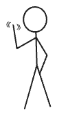
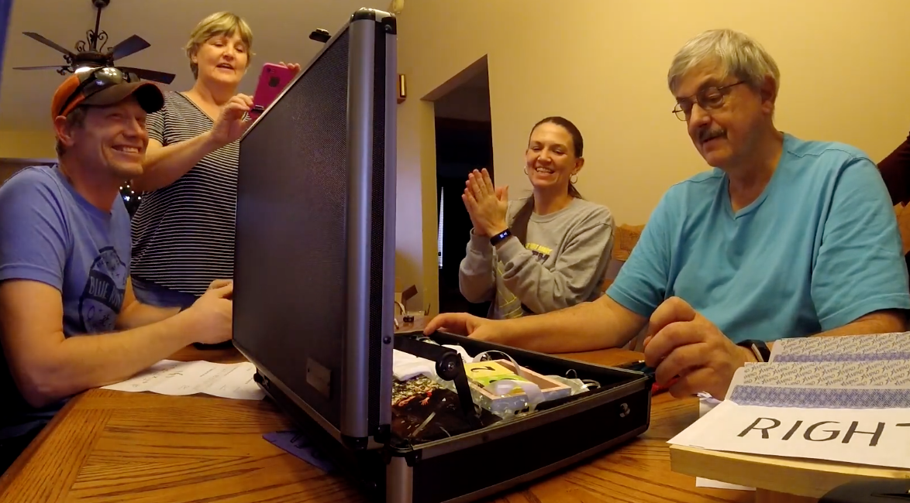
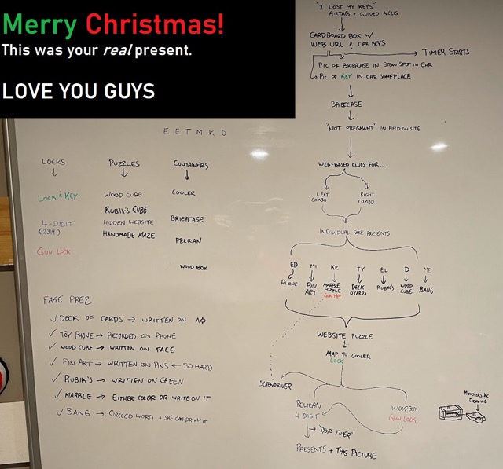
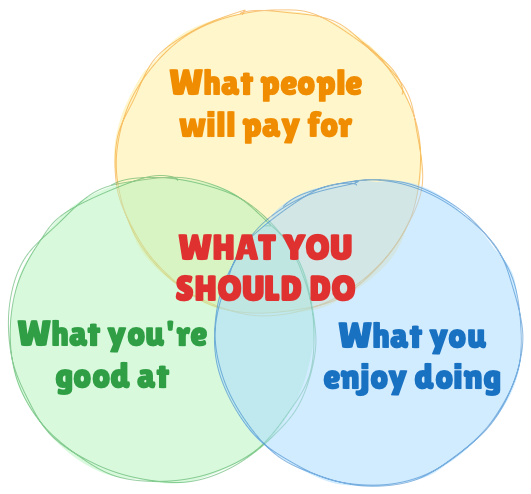
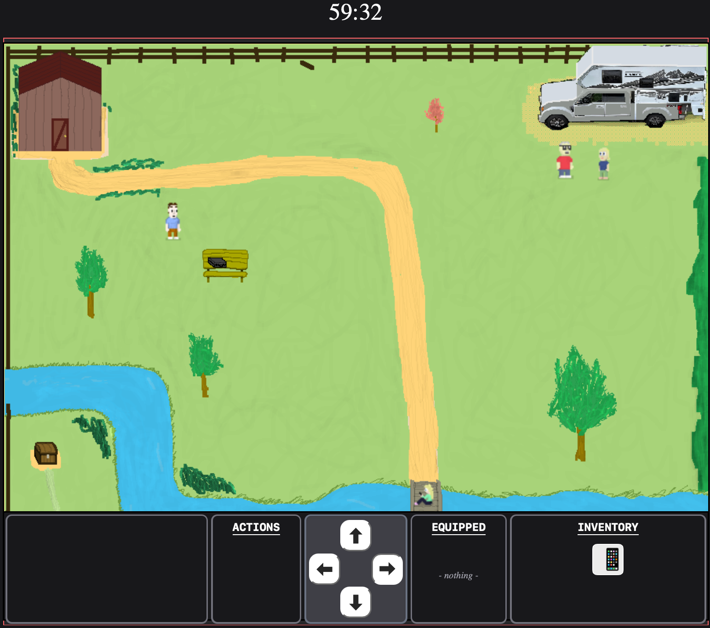

Aaron's Puzzles is one man's hobby project - creating small-scale escape room inspired puzzles. This is the "about" page.

I'm Aaron. I am a **full-stack hobbyist** with formal training in electrical engineering and data analytics. I do that for work - but for fun I [make puzzles](https://aaronspuzzles.com), [write a blog](https://aarongilly.com), [write notes](https://gillespedia.com), and maintain a [personal data journal](https://datajournal.guide).

## History

Some of my puzzles are physical, some digital, and some are both.

| Year | Box                    | Concept Tested                 | Online Feature Test           | Offline Feature Test             |
| ---- | ---------------------- | ------------------------------ | ----------------------------- | -------------------------------- |
| 2018 | [Pregnancy Announcement](#pregnancy-announcement-2018) | Basic POC                      | -                             | Briefcase + DIY simple box       |
| 2021 | [Hill Christmas](#hill-christmas-boxes-2021)         | Online/Offline POC             | Basic online proof of concept | Multiple boxes                   |
| 2022 | [The Vault](#the-vault-2022)              | Reusable boxes                 | 3D model                      | Reusable box                     |
| 2023 | [Cookie Jar](#cookie-jar-2023)             | DIY Box & parallel game design | Point & Click Adventure       | DIY Box                          |
| 2024 | [Brief Mystery](#brief-mystery-2024)          | Online only option             | Pixel art game                | Passive electronics              |
| 2025 | [Pandora's Box](#pandoras-box-2025)          | Offline-only & multiple copies | Animation                     | 3D printing & active electronics |
| 2026 | ???                    | Full-up test!                  | ???                           | ???                              |

Now for a brief history of every puzzle thus far...

### Pregnancy Announcement (2018)

My first adventure making a puzzle consisted of a lockable briefcase, terrible woodworking, and some paper print-outs. 

It was a blast to make - and went off very well!

### Hill Christmas boxes (2021)

During COVID I learned web development. I had the idea to create a puzzle *webpage* that also incorporated physical components. By Christmas 2021 I had my first cyber-physical puzzle done.

Again it was a blast to make - and again it went *very well*!

I enjoyed making puzzles. I was good at it. And people seemed to like them. Then it hit me:

I knew what I was doing for Christmas every year from then on.

### The Vault (2022)

The first box designed to be reusable was "The Vault". 

IMAGE NEEDED

The Vault was constructed primarily with off-the-shelf parts. There is one custom-built component inside it, but it's pretty janky. 

The webpage is presented as a **linear series of screens**. It was designed and built by hand without any web framework. 

### Cookie Jar (2023)

My second box might still be my favorite. 

IMAGE NEEDED

The Cookie Jar took the bespoke "hand crafted" element to the max. I planned on building 2 of them, but after probably 20 hours spent physically crafting the first one I gave up on that ambition. It was a case of "and the kitchen sink" as I threw in basically every idea and concept I had at the time.

The webpage is presented as a **point-and-click adventure**, utilizing a rotoscoped line drawing of (an approximation of) my house. You could move around by clicking on arrows and discover things.

The Cookie Jar rocked.

### Brief Mystery (2024)

After 2 successful, reusable puzzle boxes - I decided that having to *physically have* the box meant not many people did them.

The Brief Mystery was designed at the outset to be cyber-physical, but where the "physical" part was truly *optional*.

The physical part was a literal briefcase, with a simple passive electronic component inside it. That component I was able to recreate digitally.

The webpage is presented as **top-down tiny videogame**. I hand-drew and hand-coded every part of the game using HTML Canvas elements and Svelte as a framework. The puzzle is playable from any computer, right now! [Try it out](https://aaronspuzzles.com/BriefMystery)!

### Pandora's Box (2025)

Brief Mystery was an experiment in "digital only". Pandora's Box was the opposite. I made 3 functional copies.

Pandora's Box was designed in Fusion 360 and 3D printed at home. The same year I got those tools I learned enough about how to use them to create a full puzzle box from scratch.

Pandora's Box was also the first box to use a microcontroller and active electronics. Nothing fancy - but at least *something* interesting to find under the lid. 

The design is self-resetting, which is a lessons-learned from having to "reset" all the other boxes so many times (and screwing it up on more than one occasion). 

The webpage is literally just a placeholder for the animation project I did concurrent with Pandora's Box.
